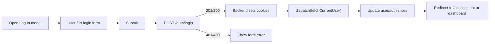
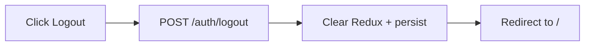

## 01. Auth UI

### 1. Призначення feature

Feature **Auth UI** відповідає за:

- логін / реєстрацію користувачів (student/teacher);
- опціональний reset password flow (якщо реалізується у MVP);
- керування станом сесії на фронтенді (без прямого доступу до токенів);
- інтеграцію з backend Auth-модулем (`docs/auth-spec.md`, `docs/modules`).

---

### 2. Модалки та компоненти

Авторизація (Sign Up, Log In, Reset password) реалізується виключно як **модальні вікна**. Окремої сторінки `/auth` та `pages/AuthPage` **не планується**.

#### 2.1. Модалки

- **Sign Up modal** — реєстрація (email, password, confirmPassword, role, language); CTA «Sign Up», перемикання на Log In.
- **Log In modal** — вхід (email, password); CTA «Log In», лінк «Forgot password?», перемикання на Sign Up.
- **Reset password modal** — один інпут email, CTA «Reset»; лінки на Sign Up / Log in.

Модалки відкриваються з Header (Sign in / Sign Up), з Landing, з кошика, з CoursePage тощо. Детальна структура та вимоги — у §8.

#### 2.2. Feature-компоненти (`src/features/auth/`)

- `LoginForm` — поля email, password; CTA «Sign in». Використовується всередині модалки Log In.
- `RegisterForm` — поля email, password, confirmPassword, role, language; CTA «Create account». Всередині модалки Sign Up.
- (Опційно) `ResetPasswordRequestForm` — всередині модалки Reset password.
- `AuthLayout` (внутрішній): картка з заголовком, описом, перемикачем видів форм у модалках.

#### 2.3. Layout/UI-компоненти

- **Modal** — обгортка для кожної модалки (Sign Up, Log In, Reset); backdrop, кнопка закриття, фокус-трап (див. §8).
- `Button`, `Input`, `PasswordInputWithToggle`, `FormField`, `Alert`.

---

### 3. State (Redux, persist)

#### 3.1. Redux slice: `auth`

Папка: `src/redux/slices/auth/`

Приблизна структура:

- `isAuthenticated: boolean` (вивід з наявності поточного користувача).
- `status: 'idle' | 'loading' | 'error' | 'success'`.
- `error: string | null`.

Actions/Thunks:

- `login` (async thunk):
  - приймає креденшіали;
  - викликає `POST /auth/login`;
  - у випадку успіху робить `dispatch(fetchCurrentUser())` з Users feature;
  - on success — `isAuthenticated = true`.
- `register` (async thunk):
  - `POST /auth/register`;
  - аналогічно, далі `fetchCurrentUser()` та редірект (на dashboard або поточну сторінку).
- `logout` (async thunk):
  - `POST /auth/logout`.
  - очищає user/auth-слайси, persist, редіректить на `/`.

#### 3.2. Persist

- `auth` slice **може частково зберігатися** (наприклад `isAuthenticated`), але не містить жодних токенів.
- Основний «факт сесії» визначається по успішному `GET /api/users/me` при старті.

---

### 4. Форми та валідація

#### 4.1. Login

- RHF з Zod-схемою (узгоджено з **docs/auth-spec.md**):
  - `email`: обов’язково, валідний email.
  - `password`: обов’язково (бекенд не вказує мін. довжину для логіну; для єдиної UX можна використовувати ті самі вимоги, що й для реєстрації).
- При сабміті:
  - викликається `login` thunk → `POST /api/auth/login`;
  - помилки:
    - 401 — показати загальну помилку над формою (наприклад, «Invalid credentials»);
    - client-side — inline під полями.

#### 4.2. Register

- RHF + Zod (**контракт бекенду**: `POST /api/auth/register` приймає `email`, `password`, `role`, `language`):
  - `email`: обов’язково, валідний email, унікальний (409 при дублікаті).
  - `password`: обов’язково, **мін. 9 символів, хоча б одна велика літера, хоча б одна цифра** (згідно auth-spec).
  - `confirmPassword`: перевірка `password === confirmPassword` (тільки на клієнті).
  - `role`: обов’язково, `student` | `teacher`.
  - `language`: опційно, `en` | `de`, за замовчуванням `en`.
- Бекенд **не приймає поле name** — у формі реєстрації можна не показувати або використовувати лише для локального відображення (якщо потрібно в макеті).
- Сабміт:
  - `register` thunk;
  - успіх: бекенд одразу встановлює cookie (access + refresh) і повертає `user` — **окремий login не потрібен**; фронт викликає `fetchCurrentUser()` і редірект (на `/assessment` або dashboard).

#### 4.3. Reset password

- Поки в **docs/auth-spec.md** немає ендпоінту reset password — модалку/форму можна реалізувати як заглушку (один інпут email + кнопка «Reset») і підключити API, коли бекенд додасть ендпоінт (наприклад, `POST /api/auth/forgot-password` з email у body).
- Валідація: email обов’язково, формат email.

---

### 5. API

Докладно `docs/auth-spec.md`, однак роути наступні

- `POST /auth/register` — створює користувача.
- `POST /auth/login` — встановлює `access_token` / `refresh_token` у cookie.
- `POST /auth/logout` — інвалідує refresh token і очищує cookie.
- `POST /auth/refresh` — оновлення access token за refresh-cookie

Frontend **не читає** токени з відгуку напряму — покладається на cookies.

---

### 6. Error Handling & Skeletons

- **Loading**:
  - кнопки сабміту мають спіннер/disabled-стан при `status = 'loading'`.
- **Errors**:
  - технічні помилки (500, network) → глобальний toast «Something went wrong, please try again».
  - 401/400 з повідомленнями типу «Invalid credentials» → показуються в Alert над формою в модалці.
- **Skeletons**:
  - форми в модалках статичні; достатньо loading-стану на кнопці сабміту.

Error Boundary окремо для Auth не потрібен.

---

### 7. Mermaid-flow основних сценаріїв

#### 7.1. Login

#### 7.2. Logout

---

### 8. Модалки авторизації та Reset паролю

Модальні вікна для **Sign Up**, **Log In** і **Reset your password** використовуються для inline-авторизації (Header, Landing, Cart, CoursePage тощо). Окремої сторінки auth немає. Вимоги нижче узгоджені з бекендом (**docs/auth-spec.md**, **docs/auth-config.md**) та дизайн-системою.

#### 8.1. Коли показувати модалки

- **З CTA на сайті:** «Sign in», «Sign Up», «Get started» на Landing, у Header, на сторінці кошика тощо — відкривати відповідну модалку (Log In або Sign Up).
- **Посилання «Forgot password?»** у модалці Log In — відкривати модалку Reset password.

#### 8.2. Структура кожної модалки

Загальна обгортка (компонент `Modal` з `src/components/ui` або `src/features/auth/`):

- **Backdrop:** затемнений фон, розмиття (backdrop-blur), клік по ньому закриває модалку.
- **Контейнер модалки:** центрування по екрану, скрол при довгому контенті, фон та тінь згідно дизайн-системи.
- **Кнопка закриття:** іконка «×» у верхньому правому куті; клік і клавіша Escape закривають модалку.

**Sign Up:**

- Заголовок: «Sign Up».
- Підзаголовок (опційно): короткий текст типу «Lorem ipsum dolor sit amet».
- Поля форми: згідно §4.2 — **email**, **password**, **confirmPassword**, **role** (student/teacher), **language** (en/de). Поле **name** у бекенд не відправляється; якщо є в макеті — тільки для локального відображення або не використовувати.
- Основна кнопка: «Sign Up», колір акценту (primary).
- Соціальні кнопки (опційно для MVP): «Sign up with Google», «Sign up with Facebook», «Sign up with Apple» — можна заглушки (без реалізації OAuth), стиль: світлий фон, бордер, іконка бренду.
- Футер: «Already have an account? **Log in**» — клік перемикає на модалку Log In (або відкриває її).

**Log In:**

- Заголовок: «Log In».
- Підзаголовок (опційно).
- Поля: **email**, **password**.
- Основна кнопка: «Log In».
- Лінк «Forgot password?» під кнопкою — відкриває модалку Reset password або перехід на reset flow.
- Соціальні кнопки: «Log in with Google» тощо (аналогічно Sign Up).
- Футер: «Don't have an account? **Sign Up**» — перемикання на модалку Sign Up.

**Reset your password:**

- Заголовок: «Reset your password» (можливо в два рядки).
- Підзаголовок (опційно).
- Поле: **email**.
- Основна кнопка: «Reset».
- Футер: «Don't have an account? **Sign Up**», «**Log in**» — перехід на відповідні модалки.

#### 8.3. Вимоги до полів і API (узгодження з бекендом)

- **Register (POST /api/auth/register):**
  - Body: `email`, `password`, `role` (`student` | `teacher`), `language` (опційно, `en` | `de`).
  - Пароль: мін. 9 символів, хоча б 1 велика літера, хоча б 1 цифра (валідація на клієнті в Zod).
  - Успіх: 201, cookie встановлюються, у тілі — `user`; окремий login не викликати.
  - Помилки: 400 (валідація), 409 (email вже зайнятий).
- **Login (POST /api/auth/login):**
  - Body: `email`, `password`.
  - Успіх: 200, cookie встановлюються, у тілі — `user`.
  - Помилки: 400, 401 (invalid credentials).
- **Reset password:** поки бекенд не надає ендпоінт — форма лише збирає email; відправку запиту реалізувати після появи API.

Токени завжди в **cookie** (Path=/api, HttpOnly, SameSite=Lax); фронт використовує `withCredentials: true`, не читає токени з JSON.

#### 8.4. Стилі (дизайн-токени)

Використовувати семантичні кольори з **docs/design-colors.md** (або **docs/design-tokens.md**):

- Фон оверлею (backdrop): напівпрозорий або `surface-overlay`.
- Фон контенту модалки: `surface-card` або `surface-background`.
- Заголовок: `text-primary`.
- Підзаголовок, плейсхолдери, лінки: `text-secondary`.
- Інпути: фон/бордер — `surface-*`, `border-default`; focus — `accent-primary` (ring або border).
- Основна кнопка (Sign Up / Log In / Reset): `accent-primary`, текст на кнопці — `text-on-accent`; hover — `accent-primary-hover`.
- Соціальні кнопки: `border-default`, `surface-card` або світлий фон, текст `text-primary`.
- Кнопка закриття: іконка кольором `text-secondary`, hover — `text-primary`.

#### 8.5. Доступність (a11y)

- Модалка: `role="dialog"`, `aria-modal="true"`, `aria-labelledby` на заголовок, `aria-describedby` на підзаголовок (якщо є).
- Фокус-трап: при відкритті фокус усередині модалки (перший фокусований елемент); Tab не виводить фокус за межі модалки; Escape закриває.
- Кнопка закриття: `aria-label="Close"` (або аналог із i18n).
- Помилки валідації: `aria-live="polite"` для області з повідомленням про помилку; `aria-invalid` та `aria-describedby` на інпути при помилці.
