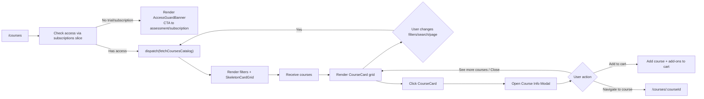

## 03. Courses Catalog UI

### 1. Призначення feature

Feature **Courses Catalog UI** відповідає за сторінку `/courses`:

- відображення списку курсів з фільтрами та пошуком;
- показ бейджів рівня, категорії (`language` / `sociocultural`), trial/premium;
- **при кліку на картку курсу** — відкриття модального вікна з детальною інформацією (опис, структура модулів/уроків, add-ons, «Add to cart»);
- інтеграцію з доступом за підпискою/trial (див. `.cursor/rules/stripe-and-access.mdc`, `docs/modules/03-courses.md`, `06-subscriptions-billing.md`).

---

### 2. Сторінки та компоненти

#### 2.1. Сторінка

- `pages/CoursesCatalogPage/CoursesCatalogPage.tsx`:
  - shell для каталогу, підключає feature-компоненти та layout.

#### 2.2. Feature-компоненти (`src/features/courses-catalog/`)

- `CoursesCatalogFilters`:
  - фільтри:
    - рівень (A1–B2);
    - категорія (`language` / `sociocultural`);
    - search (рядок);
  - debounce для пошуку.
- `CoursesCatalogList`:
  - сітка карток курсів.
- `CourseCard` (може бути в UI, якщо переюзабельна):
  - title, category badge, level badge, короткий опис, «Free trial» badge, CTA «View course».
  - **При кліку** на картку відкривається модальне вікно з детальною інформацією про курс (див. §2.3).
- `CourseInfoModal` (або в `src/components/ui`):
  - модалка, що показується при кліку на `CourseCard`; структура — у §2.3.
- `EmptyState`:
  - якщо курсів немає (фільтри занадто суворі).
- `AccessGuardBanner`:
  - банер, якщо немає активного trial/pідписки (з CTA «Start assessment» / «Subscribe»).

#### 2.3. Модальне вікно «Інформація про курс» (Course Info Modal)

При натисканні на картку курсу в каталозі відкривається **модальне вікно** з повною інформацією про курс (не перехід на окрему сторінку). Закриття — кнопка «X» у правому верхньому куті або клік по backdrop.

**Шапка модалки:**

- Кнопка закриття (іконка «X») у правому верхньому куті.
- Бейдж «Free trial» (якщо курс доступний у trial), у лівому верхньому куті контенту.
- Велике зображення курсу на всю ширину блоку контенту.
- Ряд бейджів категорій під зображенням (наприклад: «Beginner», «Grammar», «Vocabulary»).

**Основний контент:**

- Лейбл типу курсу (наприклад «LANGUAGE»).
- Назва курсу (наприклад «German A1 - Foundations»).
- Опис курсу (текстовий блок).
- Метрики: тривалість (іконка годинника + значення, напр. «24h»), кількість уроків (іконка + значення, напр. «32»).
- **Структура курсу (Course Structure):**
  - Секція з модулями; кожен модуль — розгортуваний блок (dropdown).
  - Заголовок модуля: «MODULE N: Назва» з іконкою розгортання.
  - У розгорнутому стані — список уроків з назвою та тривалістю (наприклад «Welcome to German A1 1:15», «The German Alphabet & Pronunciation 1:30»).
- **Add-ons (опції зверху):**
  - Кожен add-on: назва, короткий опис, ціна, **toggle** для додавання/видалення з замовлення.
  - Приклад: «Integration» — 355, «Visa support» — 455.

**Футер модалки:**

- Зліва: **підсумкова ціна** (наприклад «$84») з урахуванням обраних add-ons.
- Лінк «See more courses» — закриває модалку та залишає на сторінці каталогу (або прокручує до сітки курсів).
- Кнопка **«Add to cart»** — додає курс (і вибрані add-ons) у кошик і за потреби закриває модалку або показує підтвердження.

**Доступність:** модалка з `role="dialog"`, `aria-modal="true"`, `aria-labelledby` на заголовок, фокус-трап, закриття по Escape.

#### 2.4. UI-компоненти

- `Select`, `MultiSelect`, `SearchInput`, `Button`, `Badge`, `Card`, `SkeletonCardGrid`, `Pagination`, `Modal`.

---

### 3. State (Redux, persist)

#### 3.1. Redux slice: `coursesCatalog`

Папка: `src/features/courses-catalog/redux/coursesCatalogSlice.ts`.

Поля:

- `filters`:
  - `level?: 'A1' | 'A2' | 'B1' | 'B2'`;
  - `category?: 'language' | 'sociocultural'`;
  - `search?: string`;
  - `page: number`, `pageSize: number`.
- `items`: масив курсів.
- `totalCount`: загальна кількість курсів.
- `isLoading: boolean`.
- `error: string | null`.

Thunks:

- `fetchCoursesCatalog`:
  - робить `GET /api/courses` із query-параметрами (filters, pagination).

#### 3.2. Persist

- Можна (опційно) зберігати останні вибрані фільтри/сторінку в persist, щоб користувач повертався до попереднього стану каталогу.

---

### 4. Форми та валідація

Каталог не має форм із сабмітом у звичайному сенсі; фільтри працюють реактивно:

- RHF можна не використовувати; достатньо контролю статусу через локальний/Redux-стан.
- Валідація полягає в коректній побудові query-рядка для API (наприклад, не відправляти порожні фільтри).

---

### 5. API

Використовуються endpoints модуля Courses:

- `GET /api/courses`:
  - параметри:
    - `page`, `pageSize`;
    - `category`;
    - (опційно) `search`.
  - для студента:
    - доступ лише при активній підписці або trial (інакше бекенд може повертати 403/402 згідно `.cursor/rules/stripe-and-access.mdc`).

Frontend:

- при завантаженні `/courses`:
  - спочатку перевіряє доступ (див. Subscriptions feature);
  - потім робить `fetchCoursesCatalog`.

---

### 6. Error Handling & Skeletons

- **Skeletons**:
  - при `isLoading = true`:
    - показати `SkeletonCardGrid` (наприклад, 6–8 placeholder-карток).
- **Errors**:
  - 403/402 (немає доступу):
    - не показувати помилку як «failure», а рендерити `AccessGuardBanner` з CTA на assessment/subscription.
  - інші помилки (network/500):
    - показати Alert + кнопку «Retry».

Локальний Error Boundary для каталогу:

- `CatalogErrorBoundary` може обгортати контент сторінки `/courses` і показувати fallback, якщо рендер падає.

---

### 7. Mermaid-flow основного сценарію

Перехід на сторінку курсу (`/courses/:courseId`) можливий окремо (наприклад, кнопка «Go to course» всередині модалки після додавання в кошик або з картки в каталозі), основний сценарій з кліку по картці — відкриття модалки з інфою та «Add to cart».

