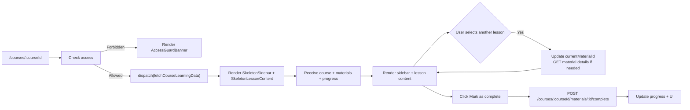

## 04. Course Learning UI

### 1. Призначення feature

Feature **Course Learning UI** реалізує сторінку `/courses/:courseId`:

- відображення структури курсу (modules/lessons) у sidebar;
- рендер контенту уроку (video, vocabulary, grammar, quiz, scenario тощо);
- управління прогресом (mark as complete, next lesson);
- збереження нотаток та інтеграція зі Scenario/Quiz logic (модуль `Progress & Quizzes`).

---

### 2. Сторінки та компоненти

#### 2.1. Сторінка

- `pages/CoursePage/CoursePage.tsx`:
  - підключає Course Learning feature, обгорнута локальним Error Boundary `CoursePageErrorBoundary`.

#### 2.2. Feature-компоненти (`src/features/course-learning/`)

- `CourseLearningLayout`:
  - організує двоколонковий layout: `Sidebar` + `LessonContent`.
- `CourseSidebar`:
  - список модулів/уроків на основі `course_materials`:
    - назва, тип, тривалість (якщо є), статус (completed/in-progress).
  - підтримка прокрутки; на mobile — drawer.
- `LessonContent`:
  - рендерить контент поточного матеріалу:
    - `VideoLesson` (type = video, YouTube embed).
    - `VocabularyLesson`, `GrammarLesson`, `TextLesson`.
    - `QuizLesson` (інтеграція з Progress & Quizzes).
    - `ScenarioLesson` (інтерактивний сценарій з гілками).
- `LessonHeader`:
  - назва уроку, бейдж типу, прогрес-індикатор.
- `LessonActions`:
  - кнопки «Mark as complete», «Next lesson».
- `LessonNotes`:
  - textarea / rich-text для нотаток, autosave (якщо реалізується).

#### 2.3. UI-компоненти

- `Sidebar`, `ListItem`, `VideoPlayer` (YouTube iframe wrapper), `Tabs`, `Accordion`, `ProgressBar`, `Button`, `Badge`, `SkeletonSidebar`, `SkeletonLessonContent`.

---

### 3. State (Redux, persist)

#### 3.1. Redux slice: `courseLearning`

Папка: `src/features/course-learning/redux/courseLearningSlice.ts`.

Поля:

- `course`: метадані курсу (`id`, `title`, `description`, `category`, `language`, `is_published`).
- `materials`: список `course_materials` для цього курсу.
- `currentMaterialId`: поточний обраний матеріал.
- `currentMaterial`: детальні дані поточного матеріалу (якщо потрібно окремий `GET`).
- `progress`: прогрес для цього курсу (по materials).
- `status: 'idle' | 'loading' | 'error'`.
- `error: string | null`.

Thunks:

- `fetchCourseLearningData(courseId)`:
  - паралельно (або послідовно) викликає:
    - `GET /api/courses/:courseId`;
    - `GET /api/courses/:courseId/materials`;
    - `GET /api/courses/:courseId/progress`.
- `selectMaterial(materialId)`:
  - змінює `currentMaterialId`;
  - (опційно) робить `GET /api/courses/:courseId/materials/:id` для деталізації.
- `completeMaterial(materialId)`:
  - `POST /api/courses/:courseId/materials/:materialId/complete`;
  - оновлює `progress` slice.

#### 3.2. Persist

- Можна зберігати останній відкритий `currentMaterialId` для кожного курсу, щоб при поверненні користувач продовжував з того місця.

---

### 4. Форми та валідація

#### 4.1. Lesson Notes

- Якщо реалізується, `LessonNotes` використовує RHF або локальний state:
  - autosave через debounce:
    - `PATCH /api/notes/:courseMaterialId` (endpoint залежить від backend-дизайну).
  - Валідація — максимально проста (обмеження довжини, заборона порожнього content за потреби).

#### 4.2. Quiz/Scenario

- Форма для квізу/сценарію описана в `05-progress-quizzes-ui.md`.
- Course Learning лише вбудовує відповідні компоненти.

---

### 5. API

Використовуються модулі `Courses`, `Course Materials`, `Progress & Quizzes`:

- `GET /api/courses/:courseId` — метадані курсу.
- `GET /api/courses/:courseId/materials` — список `course_materials`.
- `GET /api/courses/:courseId/materials/:id` — повні дані матеріалу (якщо потрібно).
- `GET /api/courses/:courseId/progress` — прогрес користувача по курсу.
- `POST /api/courses/:courseId/materials/:materialId/complete` — позначити матеріал завершеним.
- Квіз/сценарій:
  - `POST /api/quiz/attempts`;
  - `POST /api/quiz/attempts/:attemptId/answers`;
  - `POST /api/quiz/attempts/:attemptId/complete`;
  - `GET /api/quiz/attempts/:attemptId`.

---

### 6. Error Handling & Skeletons

- **Skeletons**:
  - при першому завантаженні:
    - `SkeletonSidebar` (список сірих рядків);
    - `SkeletonLessonContent` (заголовок, відео/текст-placeholder).
- **Errors**:
  - 403/402 (немає доступу):
    - показ `AccessGuardBanner` + CTA на subscription/trial.
  - 404 (курс не знайдено):
    - редірект на `NotFoundPage` або спеціальний «Course not found» екран.
  - Network/500:
    - Error Boundary `CoursePageErrorBoundary` показує fallback з CTA «Back to courses».

---

### 7. Mermaid-flow основного сценарію

