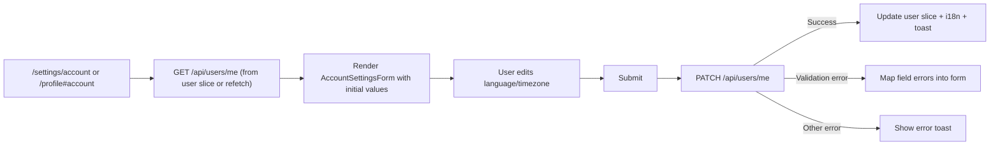

## 08. Account Settings UI

### 1. Призначення feature

Feature **Account Settings UI** відповідає за:

- зміну мови інтерфейсу (EN/DE);
- зміну timezone;
- базові налаштування акаунту (наприклад, email-переваги, ім’я, якщо воно є в моделі);
- інтеграцію з профілем користувача (модуль `Users`).

---

### 2. Сторінки та компоненти

#### 2.1. Сторінка/секція

- `/settings/account` (**AccountSettingsPage**) **або** вкладка «Account settings» у `/profile`.

#### 2.2. Feature-компоненти (`src/features/account-settings/`)

- `AccountSettingsForm`:
  - поля:
    - `language` (select: EN/DE);
    - `timezone` (select зі списком IANA-таймзон);
    - інші доступні поля з `users`/`student_profiles`/`teacher_profiles` (напр. displayName).
- `AccountDangerZone` (опційно):
  - посилання на GDPR / видалення акаунту (якщо з’явиться backend-підтримка).

#### 2.3. UI-компоненти

- `FormSection`, `Select`, `Button`, `Alert`, `TimeZoneSelect`, `SkeletonSettingsForm`.

---

### 3. State (Redux, persist)

#### 3.1. Використання `user` slice

- `AccountSettingsForm` ініціалізується з `user` slice (дані `/api/users/me`).
- При збереженні:
  - `PATCH /api/users/me` → оновлює `user` slice.

#### 3.2. Persist

- Оскільки `user` slice може бути в persist (малий snapshot), налаштування будуть запам’ятовуватися між сесіями.

---

### 4. Форми та валідація

#### 4.1. AccountSettingsForm

- RHF + Zod:
  - `language`: enum (`'en' | 'de'`).
  - `timezone`: string, але перевіряється проти списку підтримуваних значень (IANA).
  - інші поля — згідно дозволених backend-правил (див. `docs/modules/01-users.md`).
- UX:
  - `Save changes` кнопка, disabled при `isSubmitting`.
  - на успіх:
    - toast «Settings updated»;
    - i18n оновлює мову UI.

---

### 5. API

- `GET /api/users/me`:
  - використовується для початкового значення форми.
- `PATCH /api/users/me`:
  - оновлює:
    - `users.language`;
    - `student_profiles.timezone` або `teacher_profiles.*` (залежно від ролі).

Frontend не розділяє це на кілька endpoint’ів — деривація за роллю виконується бекендом.

---

### 6. Error Handling & Skeletons

- **Skeletons**:
  - `SkeletonSettingsForm` — поки чекаємо `GET /api/users/me`.
- **Errors**:
  - валідаційні:
    - мапляться у RHF (`setError`) за назвами полів.
  - технічні:
    - toast «Unable to update settings, please try again».

---

### 7. Mermaid-flow основного сценарію

