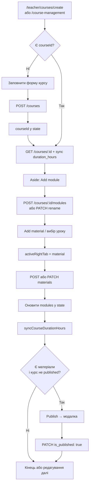
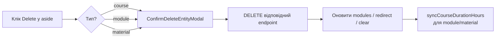
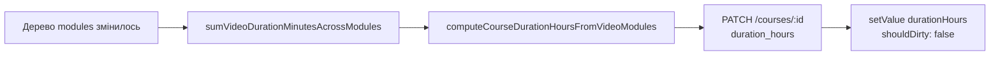

{25F6DEAE-CB26-46CB-AF27-025E119FC556}.png## 10. Teacher Course Management UI (створення / редагування курсу)

### 1. Призначення feature

Feature відповідає за **робочий простір вчителя** для створення та наповнення курсу:

- форма метаданих курсу (назва, опис, мова, категорія, рівень, теги, ціна);
- **ліва колонка** — дерево модулів і матеріалів, додавання модуля, перехід до форми курсу / матеріалу;
- **вкладка матеріалів** — створення/редагування матеріалів типів **video** (YouTube + тривалість `MM:SS`) та **quiz**;
- **публікація** курсу (`is_published: true`), якщо є хоча б один матеріал;
- **видалення** курсу, модуля або матеріалу з підтвердженням у модалці;
- **автосинхронізація `duration_hours`** на бекенді з сумарної тривалості відео-уроків (див. §5.3).

Бекенд-контракти: `docs/modules/03-courses.md`, `docs/modules/04-course-materials.md` (кореневий `docs/` репозиторію).

---

### 2. Маршрути та сторінка

**Маршрути** (`src/helpers/routes.ts`, `src/routes/index.tsx`):

- `/course-management` — той самий екран керування;
- `/teacher/courses/create` — створення нового курсу;
- `/teacher/courses/:courseId/edit` — зареєстрований маршрут редагування (lazy: `CourseManagmentPage`).

Усі три варіанти обгорнуті в `PrivateGuard` (потрібна авторизація).

**Сторінка:** `pages/CourseManagmentPage/CourseManagmentPage.tsx` — єдина сторінка для create/edit; після успішного `POST /courses` у state зберігається `courseId`, далі завантажується дерево модулів через `GET /courses/:id`.

> **Примітка (поточна реалізація):** компонент **не** читає `courseId` з `useParams()` при відкритті `/teacher/courses/:courseId/edit`, тобто «глибоке» відкриття редагування лише за URL потребує окремого `useEffect` + `GET /courses/:courseId` + заповнення форми — це варто додати, коли підключать навігацію з каталогу/профілю вчителя.

---

### 3. Сторінки та компоненти

#### 3.1. Сторінка

- `pages/CourseManagmentPage/CourseManagmentPage.tsx`:
  - layout: **aside** (структура курсу) + **прокручувана** робоча область;
  - верхній фіксований рядок з посиланням «All courses» → `/courses`;
  - перемикання **правої панелі**: вкладка **курс** (`activeRightTab === 'course'`) / **матеріал** (`'material'`).

#### 3.2. Feature `src/features/course-managment/`

- **`CourseStructureAside`** (`components/CourseManagementWorkspace/courseStructureAside/`):
  - відображення назви курсу та дерева модулів/матеріалів;
  - дії: вибір «Course details», **Add module**, створення/вибір матеріалу в модулі, **Publish** (умова: `courseId`, є матеріали, курс ще не опублікований), **видалення** курсу/модуля/матеріалу.
- **`CourseCoverSection`**, **`CourseDetailsSection`**, **`CourseTagsSection`**, **`CoursePriceSection`**, **`CourseDurationSection`** (`parts/`):
  - поля форми курсу; блок тривалості показує **обчислені** хвилини відео та кількість video-уроків (не редагується вручну в цій секції — джерело правди для відображення — дерево матеріалів).
- **`CourseCreateActions`**:
  - режим **create**: кнопка створення курсу (коли ще немає `courseId`);
  - режим **edit**: кнопка оновлення курсу (коли `isEditingCourse` і форма `dirty` + `valid`).
- **`CourseMaterialCreateTab`** (`courseMaterial/`):
  - форми для **video** / **quiz**, створення та оновлення матеріалу через колбеки `onCreate` / `onUpdate` (виклики API на сторінці).
- **`CreateCourseModuleModal`**:
  - режими **create** / **edit** заголовка модуля.
- **`ConfirmDeleteEntityModal`**, **`ConfirmPublishCourseModal`**:
  - підтвердження видалення сутності та публікації курсу.

#### 3.3. Допоміжні модулі

- `validation/createCourseSchema.ts` — Zod + RHF.
- `helpers/courseTreeStats.helpers.ts` — підрахунок відео, хвилин, `duration_hours` для PATCH.
- `helpers/courseEntityDeleteCopy.helpers.ts`, `helpers/courseEntityPublishCopy.helpers.ts` — тексти модалок.
- `helpers/courseModuleMaterialCounts.helpers.ts` — кількості типів матеріалів для опису видалення модуля.

#### 3.4. Обкладинка курсу

- `CourseCoverSection` дозволяє обрати файл і показати **локальний preview** (`coverPreviewUrl`). Надсилання обкладинки на бекенд у поточному коді **не** підключене до `POST/PATCH` курсу (лише прихований input з ім’ям файлу для майбутньої інтеграції).

---

### 4. State (локальний + RHF)

**Redux slice для цього екрану не використовується.**

Основний state на `CourseManagmentPage`:

- **`courseId`**, **`isEditingCourse`**, **`isCoursePublished`**;
- **`modules`** — дерево модулів з матеріалами (після `GET` та локальних оновлень);
- **`activeRightTab`**, **`activeModuleIdForMaterial`**, **`activeMaterialIdForEdit`** — навігація по правій панелі;
- модалки: модуль, видалення, публікація;
- **`deleteTarget`** — тип сутності для `ConfirmDeleteEntityModal`;
- **`coverFile`**, **`coverPreviewUrl`**, **`priceCurrencySymbol`** — UI-стан;
- прапорці завантаження: `isCreatingCourse`, `isUpdatingCourse`, `isCreatingMaterial`, `isDeletingEntity`, `isPublishingCourse`;
- **`createCourseError`** — текст помилки з API для форми.

**Форма курсу:** `react-hook-form` + `zodResolver(createCourseSchema)`, `mode: 'onChange'`.

---

### 5. Форми та валідація

Файл: `features/course-managment/validation/createCourseSchema.ts`.

- Обов’язкові: **title**, **price** (не від’ємне число в рядку), **tags** (мінімум один), **level** (A1–B2), **language**, **category**.
- **description** — опційно, до 5000 символів.
- **durationHours** — опційно; якщо заповнено — невід’ємне ціле (ручне значення при create/update; окремо бекенд оновлюється з відео — див. §5.3).

Після появи `courseId` поля форми **заблоковані**, доки користувач не натисне «Course details» в aside (`isEditingCourse === true`).

---

### 6. API

Використовується `apiInstance` та `API_ENDPOINTS` (`src/api/apiEndpoints.ts`).

#### 6.1. Курс

- `POST /courses` — створення (`is_published: false` у payload).
- `GET /courses/:courseId` — метадані + **`modules`** (дерево для UI); після відповіді викликається синхронізація тривалості (§5.3).
- `PATCH /courses/:courseId` — оновлення полів курсу; окремо — `{ is_published: true }` для публікації; окремо — `{ duration_hours }` для синхронізації з відео.
- `DELETE /courses/:courseId` — видалення курсу; після успіху — редірект на `/courses`.

#### 6.2. Модулі

- `POST /courses/:courseId/modules` — створення (з `order_index`).
- `PATCH /courses/:courseId/modules/:moduleId` — перейменування.
- `DELETE /courses/:courseId/modules/:moduleId` — видалення; далі `syncCourseDurationHours`.

#### 6.3. Матеріали

- `POST /courses/:courseId/modules/:moduleId/materials` — створення (`type`, `title`, `content`, `order_index`).
- `PATCH .../materials/:id` — оновлення.
- `DELETE .../materials/:id` — видалення.

**Video `content`:** `youtube_video_id`, `duration` (рядок `MM:SS`).

**Quiz `content`:** нормалізовані питання з `options` та `correct` (одне або кілька id для multi-correct).

#### 6.4. Синхронізація `duration_hours` з відео

Після операцій, що змінюють дерево матеріалів (завантаження курсу, видалення модуля/матеріалу, create/update матеріалу), викликається **`syncCourseDurationHours`**:

- `computeCourseDurationHoursFromVideoModules` (`courseTreeStats.helpers.ts`) — сума хвилин з усіх video, потім **ceil до годин**; якщо відео немає або 0 хв — `null` → на бекенд `duration_hours: null`;
- `PATCH /courses/:id` з `{ duration_hours }`;
- оновлення поля форми `durationHours` через `setValue` (без позначення форми як `dirty`).

Помилка PATCH тривалості **ігнорується** в `catch` (локальне дерево вже актуальне).

---

### 7. Error Handling & Modals

- Помилки **create/update** курсу: повідомлення з `response.data.message` (або fallback) у **`createCourseError`** біля дій форми.
- **Видалення / публікація:** кнопки в модалках disabled під час `isDeletingEntity` / `isPublishingCourse`; закриття модалки блокується на час сабміту.
- Мережеві помилки для PATCH тривалості не показуються окремо (див. §6.4).

---

### 8. Mermaid-flow: головний сценарій (створення та наповнення)

---

### 9. Mermaid-flow: видалення сутності

---

### 10. Mermaid-flow: синхронізація тривалості

---

### 11. Пов’язані документи

- Бекенд: `docs/modules/03-courses.md`, `docs/modules/04-course-materials.md`.
- Каталог / навчання (студент): `docs/frontend-features/03-courses-catalog-ui.md`, `docs/frontend-features/04-course-learning-ui.md`.
