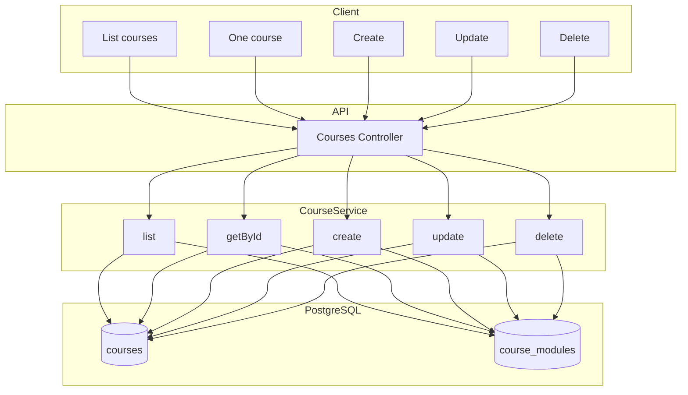

# Модуль: Courses

Курси платформи: створення/редагування вчителем, список курсів для студента. **MVP:** показуємо всі курси; фільтрацію за доступом/рівнем можна додати пізніше.

---

## 1. Призначення

- **Вчитель:** будь-який вчитель може **створювати, редагувати та видаляти будь-який курс**; так само — **модулі курсу** (Course → Module → Material). Усі вчителі мають однаковий доступ. Модулі та матеріали — у цьому модулі та в Course Materials.
- **Студент:** каталог — список усіх опублікованих курсів. Доступ до **модулів і матеріалів** курсу — лише якщо є запис у **user_course_access** для цього курсу (trial, купівля або активна підписка).
- Категорія курсу: `language` | `sociocultural` (Integration & Life in Germany). Фільтр за category/language — за потреби.

---

## 2. Дані (таблиці БД)

| Таблиця | Операції |
|---------|----------|
| courses | читання, створення, оновлення, видалення (будь-який вчитель) |
| course_modules | читання, створення, оновлення, видалення модулів курсу (доступ до курсу = доступ до модулів) |

---

## 3. Сервіс

**CourseService:**

- Список курсів: опубліковані (is_published = true); опціонально фільтр за category, language.
- Для вчителя: створення/оновлення/видалення курсу; CRUD **модулів курсу** (course_modules): список модулів курсу, створення, оновлення, видалення модуля.
- Отримання одного курсу по id (метадані; з include modules — за потреби для відображення структури).

---

## 4. Ендпоінти (базові)

| Метод | Шлях | Опис | Роль |
|-------|------|------|------|
| GET | /api/courses | Каталог: список опублікованих курсів (фільтри за бажанням). | авторизований |
| GET | /api/courses/:id | Один курс по id (метадані; опціонально з модулями). Перегляд модулів/матеріалів — з перевіркою user_course_access. | авторизований |
| GET | /api/courses/:id/modules | Список модулів курсу (по order_index). Доступ: якщо є user_course_access до курсу або вчитель. | авторизований |
| POST | /api/courses/:id/modules | Створити модуль у курсі. | teacher |
| GET | /api/courses/:id/modules/:moduleId | Один модуль. | авторизований |
| PATCH | /api/courses/:id/modules/:moduleId | Оновити модуль. | teacher |
| DELETE | /api/courses/:id/modules/:moduleId | Видалити модуль. | teacher |
| GET | /api/courses/my | Курси, до яких у студента є доступ (user_course_access). | студент |
| POST | /api/courses | Створити курс. | teacher |
| PATCH | /api/courses/:id | Оновити курс. | teacher |
| DELETE | /api/courses/:id | Видалити курс. | teacher |

**Правило доступу:** каталог (GET /api/courses) — всі опубліковані курси. Доступ до модулів (GET /api/courses/:id/modules) та матеріалів (GET /api/courses/:courseId/modules/:moduleId/materials) дозволений лише при наявності запису в **user_course_access** для (user_id, course_id) з активним trial, купівлею або активною підпискою. Вчитель має доступ до всіх курсів і модулів.

Курси не прив'язані до конкретного вчителя: будь-який вчитель має однакові права створювати, редагувати та видаляти будь-який курс.

---

## 5. Діаграма

---

## 6. Примітки

- Курси спільні для всіх вчителів: жодного обмеження «тільки автор» або «тільки власний курс». У БД поле teacher_id (якщо є) може зберігати «хто створив» для історії, але не використовується для обмеження доступу.
- Доступ до контенту (підписка/trial) для MVP може бути м'якою. Деталі матеріалів — модуль Course Materials.
